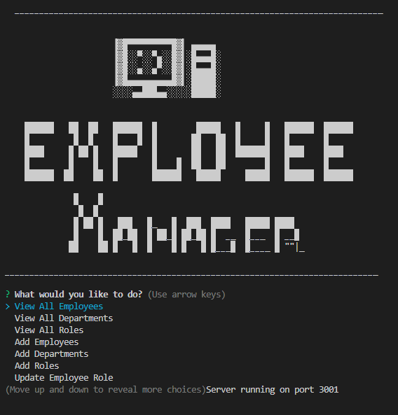
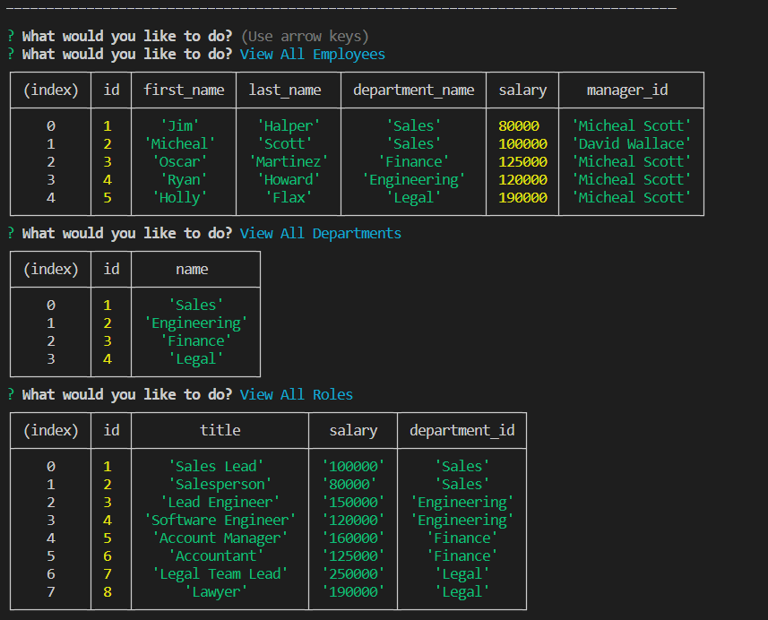

<a id="badges"></a>
[](https://opensource.org/licenses/MIT)

# **Workforce Manager** 🖥 _CRM_

## Description

Imagine a world where managing your employees is a breeze. Forget clunky spreadsheets and endless paperwork. This node.js back-end CRM is your secret weapon to streamlining your company's structure.

Effortlessly organize your departments, keep track of your employees, and ensure seamless communication between managers and their teams. This powerful tool, fueled by the innovative Inquirer.js library, is designed to empower your organization and propel it to new heights of productivity.

But that's not all! This CRM is brimming with potential, and exciting new features are on the horizon. Stay tuned as we unleash the full arsenal of functionalities to take your workforce management to the next level!

## Table of Contents

1. [Usage](#usage)
2. [Installation Code](#installation)
3. [Screenshot](#screenshot)
4. [License](#license)
5. [Dependencies](#depend)
6. [Roadmap](#roadmap)
7. [Links](#links)
8. [Questions](#support)
9. [Credits](#credits)

---

<a id="usage"></a>

## Usage

Download the Clone Repo from the links section below.
<br>
Open Terminal and Navigate to Folder
<br>
Install necessary dependencies <em>(view Dependencies section below)</em>
<br>
Run the following code in the terminal:

<a id="installation"></a>

```
  node i
```

_then_

```
npm run start
```

This tool will guide you through a series of prompts to to navigate the CRM and manage your employees successfully!

---

<a id="screenshot"></a>

## Screenshot





---

<a id="license"></a>

## License

### [MIT](https://opensource.org/licenses/MIT)

---

<a id="depend"></a>

## Dependencies

```
"dependencies": {
    "eventemitter3": "^5.0.1",
    "express": "^4.18.2",
    "inquirer": "^8.2.4",
    "mysql2": "^3.6.3",
    "node": "^21.1.0"
  }
```

---

<a id="roadmap"></a>

## Roadmap

<ins> I would like to add functionality to: <ins>

- view budget department
- update managers
- view manager by employee
- view employees by department
  _and_
- delete departments, roles, and employees

<ins> I would also like the Prompt Lists: <ins>

- Managers
- Departments
- Salaries, etc

to be pulling from Database rather than static options. This will be rolled out in later development!

---

<a id="links"></a>

## Links

<div align="center">

#### [Repo Link](https://github.com/8BitGinger/workforceManager)

#### [Deployed Link](https://8bitginger.github.io/workforceManager/)

#### Clone Link:

_(copy this and paste into terminal at Folder location of your choice)_

```
git clone git@github.com:8BitGinger/workforceManager.git
```

#### [Demo Video Link](https://www.veed.io/view/deda9468-f105-42e7-8f19-190046f40223?panel=share)

**_recorded with [ScreenCastify](https://screencastify.com) and edited with Veed.IO_**

</div>

---

<a id="support"></a>

## Questions

Reach out with Questions or for Support here:

[Email](mailto:ryan.fann@gmail.com)

_GitHub_

[8BitGinger](https://github.com/8BitGinger)

---

<a id="credits"></a>

## Credits

[Screencastify](https://screencastify.com)

[Veed.IO](https://veed.io)

[Google Fonts](https://fonts.google.com)
