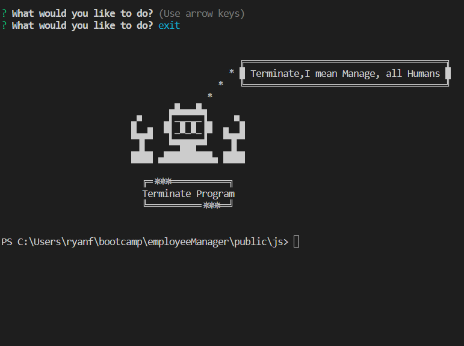

<a id="badges"></a>
[](https://opensource.org/licenses/MIT)


# **Workforce Manager** 🖥 ***CRM***

## Description
A back-end CRM for managing your Workforce.  It allows you to keep track of things like your departments, the employees, and their managers, with additional functionality coming soon.  It takes advantage of inquirer npm to take your company to the next level!


## Table of Contents
1. [Usage](#usage)
2. [Installation Code](#installation)
3. [Contributing](#contributing)
4. [Screenshot](#screenshot)
5. [License](#license)
6. [Roadmap](#roadmap)
7. [Links](#links)
8. [Questions](#support)
9. [Dependencies](#depend)
10. [Credits](#credits)

---

<a id="usage"></a>
## Usage
> - Download the Clone Repo from the links section below.  <br>
> - Install necessary dependencies <em>(view Dependencies section below)</em> <br>
> - then run the following code in the terminal:

<a id="installation"></a>
```
  node index.js
```

---

<a id="contributing"></a>
## Contributing
N/A


<a id="screenshot"></a>
## Screenshot




---


<a id="license"></a>
## License
[MIT](https://opensource.org/licenses/MIT)


<a id="roadmap"></a>
## Roadmap
Would like to add functionality to view budget department, update managers, view manager by employee, view employees by department, and delete departments, roles, and employees.


<a id="links"></a>
## Links
### Repo Link:
 https://github.com/8BitGinger/workforceManager
### Deployed Link:
https://8bitginger.github.io/workforceManager/
### Clone Link:
```
git@github.com:8BitGinger/workforceManager.git
```
### Demo Video Link:
> https://www.veed.io/view/deda9468-f105-42e7-8f19-190046f40223?panel=share
 
 ***recorded with ScreenCastify and edited with Veed.IO***


<a id="support"></a>
## Questions
Reach out for Questions or Support here:
### Email: 
ryan.fann@gmail.com
#### GitHub Username: 
[8BitGinger](https://github.com/8BitGinger)

<a id="depend"></a>
## Dependencies
```
"dependencies": {
    "eventemitter3": "^5.0.1",
    "express": "^4.18.2",
    "inquirer": "^8.2.4",
    "mysql2": "^3.6.3",
    "node": "^21.1.0"
  }
```

<a id="credits"></a>
## Credits
[Screencastify for Video Recording](https://screencastify.com)
Veed.IO for Video Editing
Google Fonts for HTML